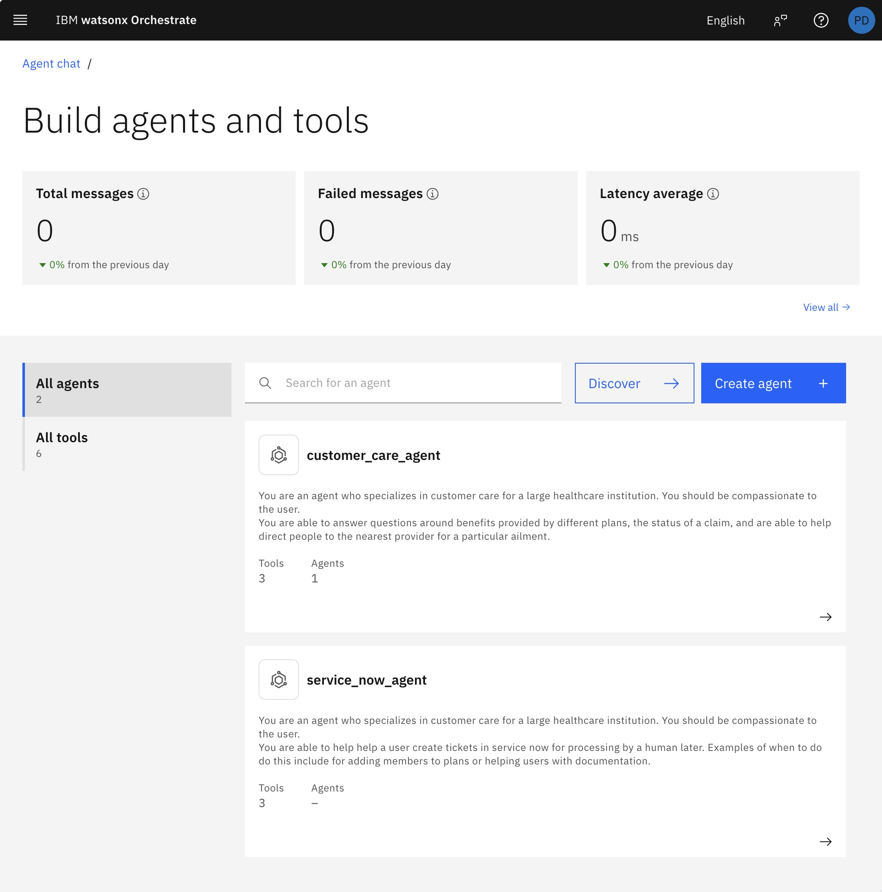

# Deploying to SaaS

In previous tutorials we've been using the local environment to host our agents and tools. In this tutorial we will see how we can deploy our agents and tools to a SaaS instance of Watson Orchestrate.
We'll assume that you have already completed the previous tutorials and we'll learn how to push one of those agents to a SaaS instance.

The following steps guide us thru this.

1. Login to your SaaS instance and get the URL and API key for your SaaS instance settings. You may need to create an API key if you don't have one already.

   

2. Add a new environment for your saas instance.

   ```bash
   orchestrate env add \
       -n my-saas \
       -u https://api.us-south.watson-orchestrate.cloud.ibm.com/instances/<instance-id> \
       --type ibm_iam \
       --activate
   
   # [INFO] - Environment 'my-saas' has been created
   # Please enter WXO API key: ●●●●●●●●       <== Enter the API key you created in Step 1
   # [INFO] - Environment 'my-saas' is now active
   ```

3. Now let's verify that the environment is created and active.

   ```bash
   orchestrate env list

   # my-saas  https://api.us-south.watson-orchestrate.cloud.ibm.com/instances/<instance-id>  (active) 
   # local    http://localhost:4321
   ```

4. Now let's install the tools and agents from [previous tutorial](../02-customer-care-agent/) to our SaaS instance.

   ```bash
   # create an application connection named service-now
   orchestrate connections add -a service-now

   # configure a draft environment for service-now app connection with draft environment URL
   orchestrate connections configure -a service-now --env draft --type team --kind basic --url <e.g., https://dev123456.service-now.com/>

   # set the credentials to access the draft environment for service-now application integration
   orchestrate connections set-credentials -a service-now --env draft -u admin -p <password you noted above>

   cd ../02-customer-care-agent
   ./import-all.sh
   ```

You should now be able to see the `customer_care_agent`, and `service_now_agent`, in your SaaS instance.



We added connection and credentials for the service-now application only in the **Draft** environment. With this you'll be able to try the agents in the draft environment.


However, when you click on the **Publish** button to share your agent with others, you'll be prompted to add the connection and credentials for the live environment as well. You can do that by following the same steps as above, but this time using `--env live` (instead of `--env draft`) with your live environment URL and credentials for your service-now application.