# Using an MCP toolkit with your agent (No code)

In this tutorial we will add MCP tools from GitHub server to our agent.
We will use the reference implementation of a GitHub MCP server to demonstrate this.

```json
{
    "command": "npx",
    "args": ["-y", "@modelcontextprotocol/server-github"],
    "env": {
        "GITHUB_PERSONAL_ACCESS_TOKEN": "<YOUR_TOKEN>"
    }
}
```

Following steps guide us thru this.

* Create a GitHub personal access token. (If you don't have one already)
* Go to the **Manage > Connections** on Orchestrate dashboard
   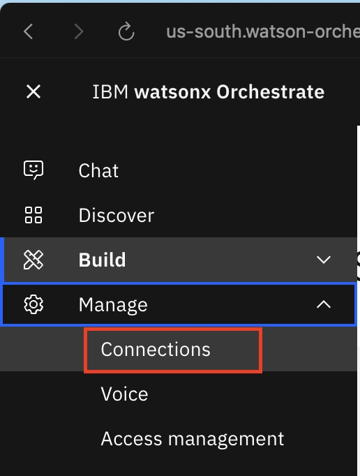
* Let's add a new connection
   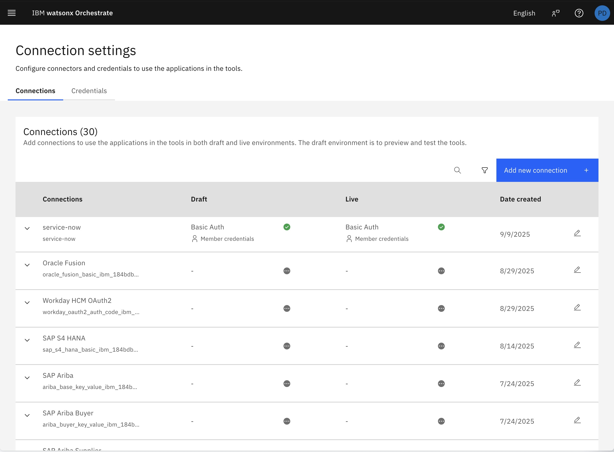
* Let's save and continue
   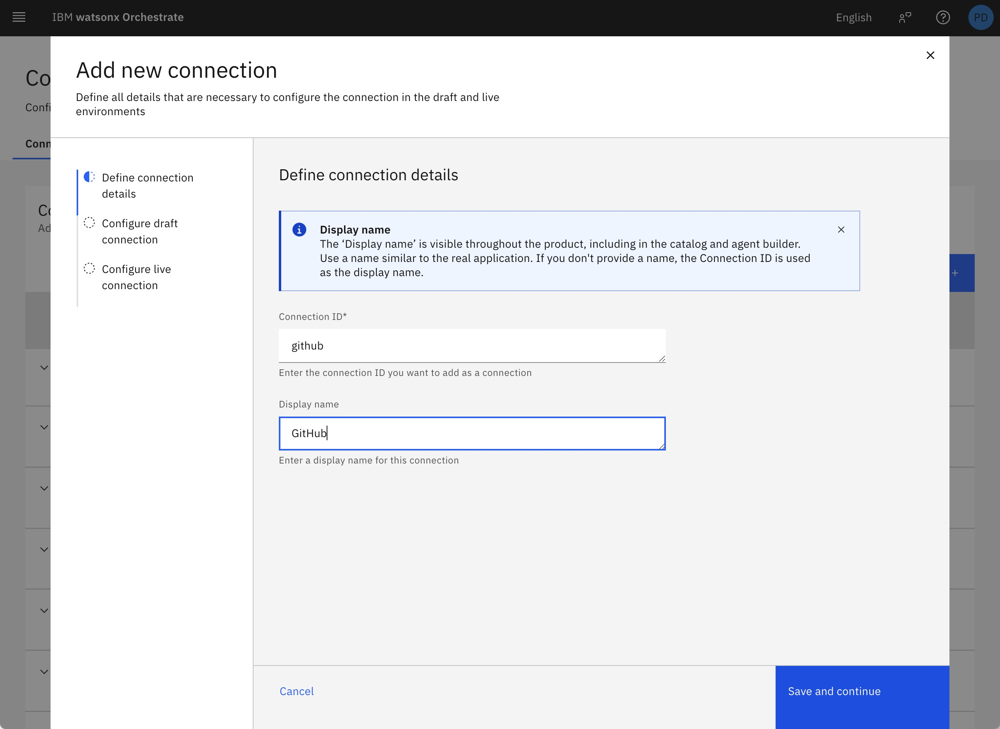
* Now configure key-value type credentials for the draft | live environments as needed (and connect).
   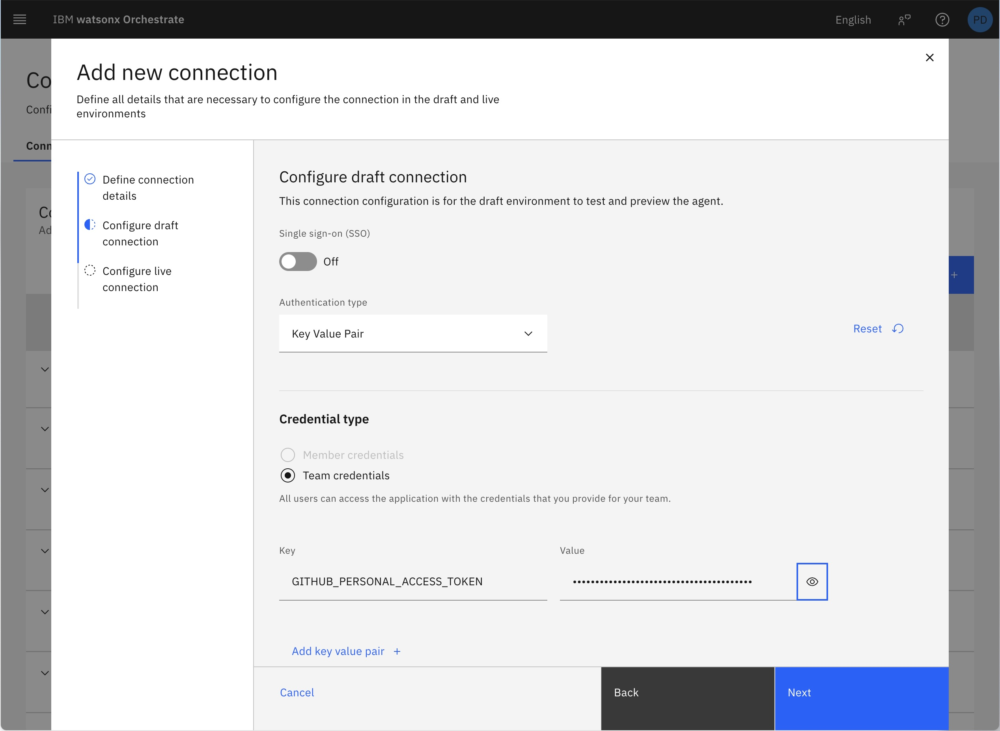

---

We could just point select our SaaS environment, and import the MCP server toolkit using the CLI as below:

   ```bash
   # Set the environment
   orchestrate env activate my-saas

   # Import the toolkit
   orchestrate toolkits import \
     --kind=mcp \
     --name=mcp-github \
     --language=node \
     --description='All the Github tools' \
     --package='@modelcontextprotocol/server-github' \
     --command='npx -y @modelcontextprotocol/server-github' \
     --tools="*" \
     --app-id=github
   ```

---

Here's how to do this using the Orchestrate dashboard UI:

- Go to the **Agent Builder** on Orchestrate dashboard
   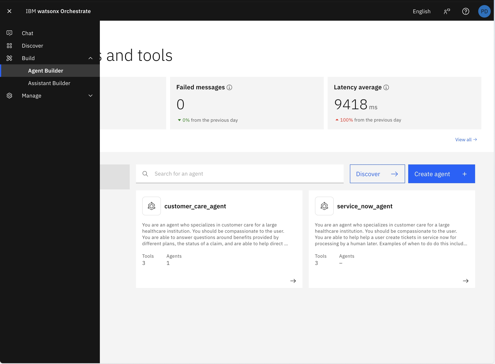
- Let's **create a new agent from scratch** with the following details:
      - Name: github-agent
      - Description: An agent that interacts with GitHub repositories to do various GitHub activities like repo listing, issue management, commit listing etc.
- Let's now go to the **Toolset** section and click on **Add tool +** and **Import external**
   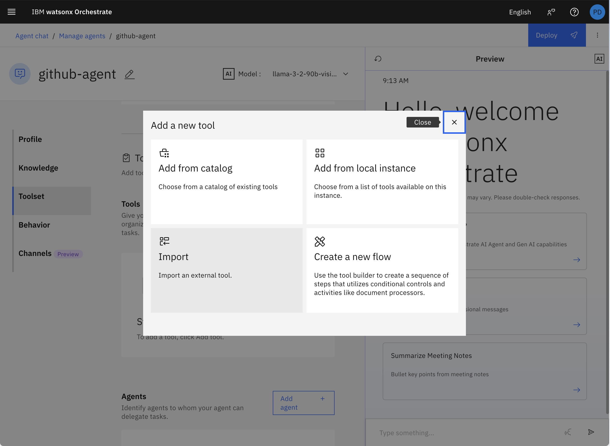
- And then select the "Import from MCP server" option
   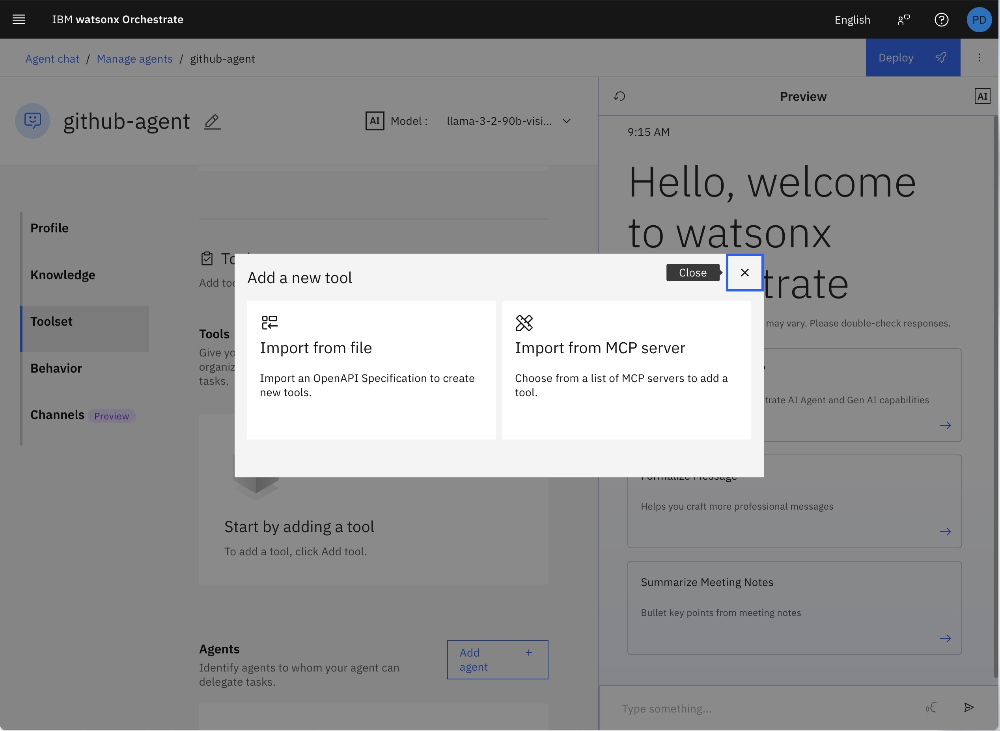
- Here let's **Add MCP server** with the following details:
   - Name: github
   - Description: Toolkit for GitHub MCP Server tools
   - Connection: github (the one we created earlier)
   - Install Command: `npx -y @modelcontextprotocol/server-github`

   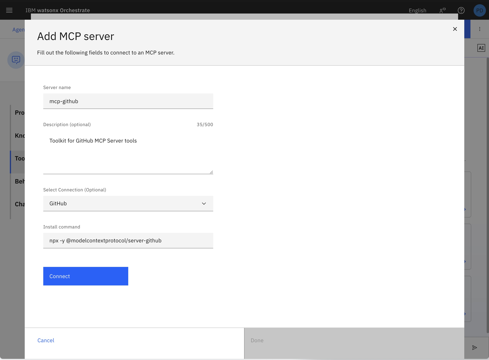
- You should see a Connection successful message if everything is fine.
   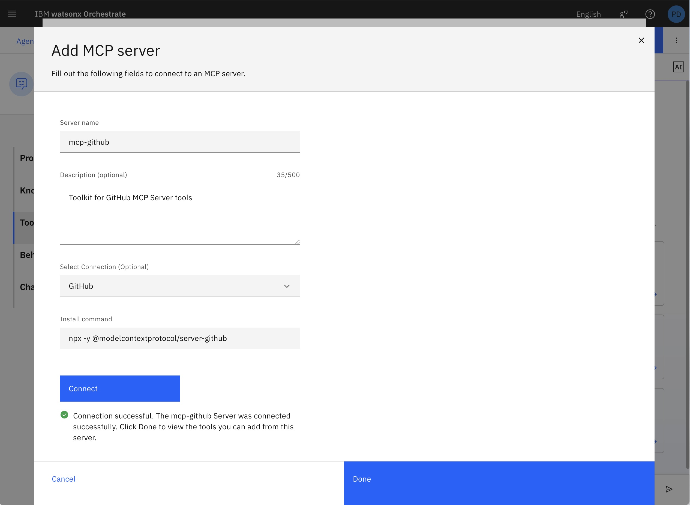
- Now let's search and add `list_commits`
   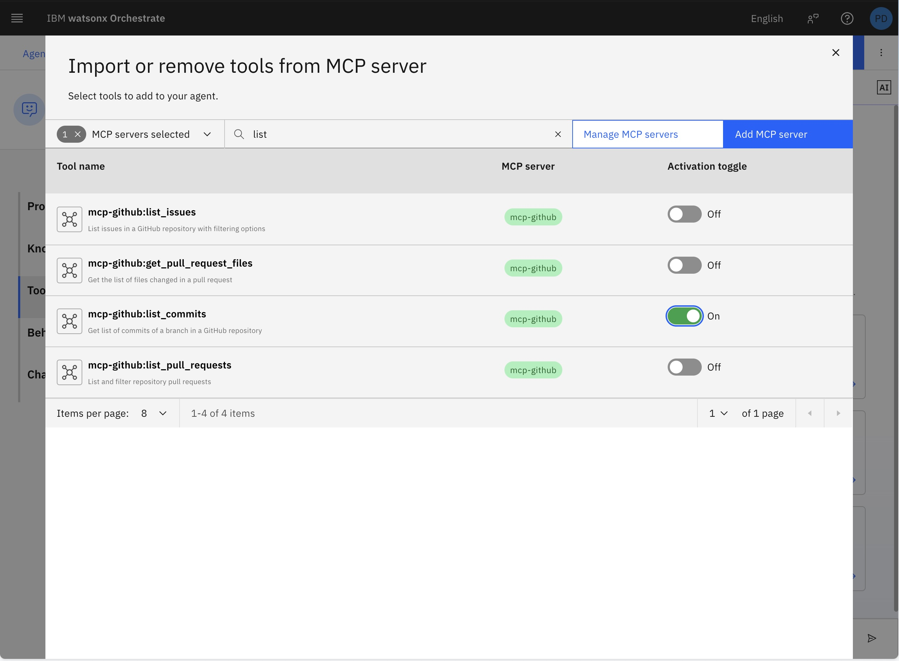
- Similarly, let's add `list_repositories`

5. Try it out
   - List my (pdhoolia) "*tutorial" repositories
   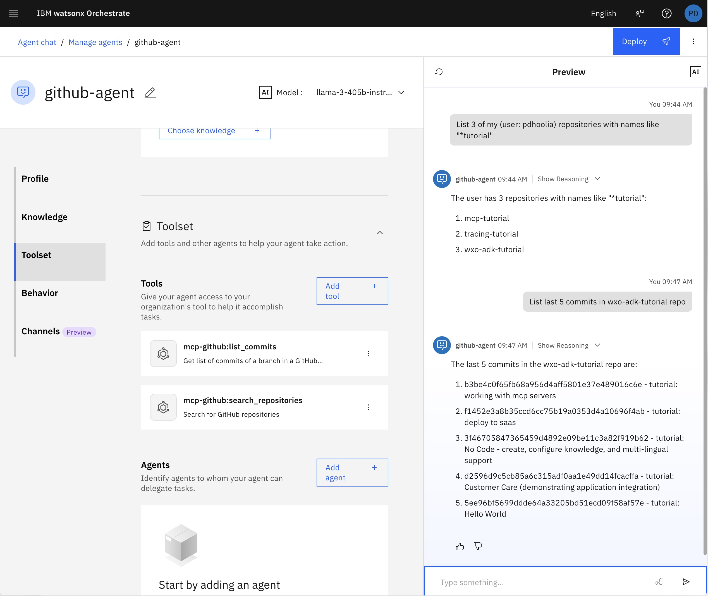
   - List commits: List last 5 commits in my wxo-tutorial repo
