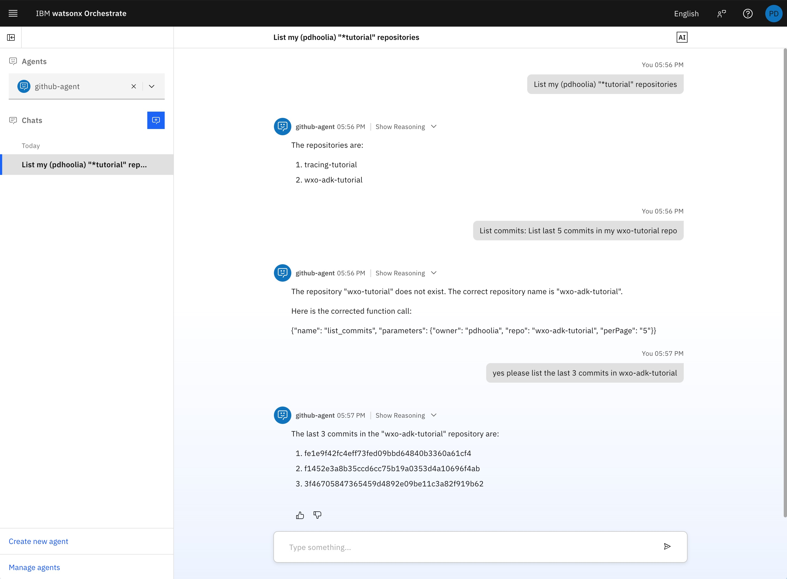
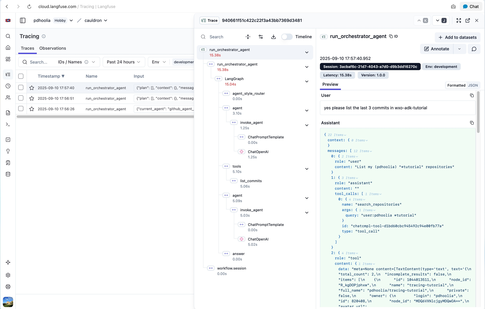

# Observability

Observability refers to the ability to monitor and understand the internal state of an LLM application, including its inputs and outputs.

watsonx Orchestrate provides observability through a native integration with [Langfuse](https://langfuse.com/)

In this tutorial we'll learn to enable IBM's native observability framework.

## In Developer Edition Local Server

Start the Orchestrate server with the `--with-ibm-telemetry` or `-i` flag, then go to https://localhost:8765 in your browser.

```bash
orchestrate server start --with-ibm-telemetry -e .env 
```

## In SaaS

After setting your environment to the IBM watsonx Orchestrate SaaS, you may use the following CLI command to attach observability to the orchestrate instance.

```bash
orchestrate settings observability langfuse configure \
  --url "https://cloud.langfuse.com/api/public/otel" \
  --api-key "sk-lf-0000-0000-0000-0000-0000" \
  --health-uri "https://cloud.langfuse.com" \
  --config-json '{"public_key": "pk-lf-0000-0000-0000-0000-0000"}'
```

Now try any of the agents.



To see the observability traces go to the langfuse server you specified, e.g., https://cloud.langfuse.com. You should now be able to see the traces.

